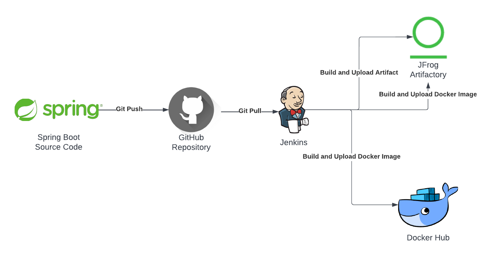

# JFROG DEMO
This git repository contains the deliverables for the JFROG Technical Demo Presentation.

## SUMMARY
This git repository contains the source code for the [**Spring PetClinic Application**](https://github.com/spring-projects/spring-petclinic) along with the necessary **pom.xml** file required for building the application. The repository also contains a **Jenkinsfile** and a **Dockerfile** used to build and publish the application as a runnable docker image.

## DEMO ARCHITECTURE SETUP

The above diagram represents the environment used to create the demo deliverables. The source code was obtained from the provided [github repository](https://github.com/spring-projects/spring-petclinic) for the **Spring PetClinic Application**. The Jenkins server and the Artifactory server were run locally on the workstation as docker containers. Finally a public repo was created on dockerhub to host the runnable application docker image that will be created as a part of the Jenkins pipeline run.

**\*\*Please refer the [*getting-started*](./resources/docs/getting-started.md) doc to setup a similar environment locally on your workstation.\*\***

## Run the project

### Prerequisites
- An existing github account to clone the existing repository into.
- A running Jenkins Instance with [Credentials](https://github.com/jenkinsci/credentials-plugin/blob/master/docs/user.adoc), [Pipeline](https://www.jenkins.io/doc/book/pipeline/jenkinsfile/), and [Artifactory](https://www.jenkins.io/doc/pipeline/steps/artifactory/#artifactory-plugin) plugins installed at minimum.
- A running Artifactory Server with a maven repository setup for storing artifacts.
- A repository created on dockerhub to store the image.
> **NOTE**: Follow the readme under **resources/docs** if you need help with any of the prerequisites mentioned above.
  
>  **NOTE**: The **dockerhub** piece of the architecture can be replaced by your preferred choice of image repository to store the image. This will need a small change in the **Jenkinsfile** in the way the built image is being tagged. 
  
### Steps

#### I - Clone the current repository into your own git repo
1. Create a repo in your github account.
2. Clone the repo.<br />
   ```git clone https://github.com/Sagardas72/jfrog-demo.git```
3. Push the cloned repo to your git repo.
   ```
   git add .
   git commit -m "First commit"
   git push --mirror <your git repo url>
   ```
   
#### II - Setup Jenkins Server & Run the Pipeline

###### Create credentials
1. Login to Jenkins Server and select **Manage Jenkins -> Manage Credentials**.
2. Click on **Jenkins** and on the next page click on **Global Credentials**.
3. On the left tab, click on **Add Credentials**.
4. On the next page, select **Username with password** as the kind, keeping the scope Global, and add the username/password for your github account. Under **ID** add a meaningful name for the credentials (for example, sagardas72-github-credentials). 
   > **NOTE**: For the password, use a personal access token (PAT), instead of your password, as github has moved away from using your account password. Follow the steps in [this link](https://docs.github.com/en/authentication/keeping-your-account-and-data-secure/creating-a-personal-access-token) to setup the personal access token for your github account.
5. Perform the same set of steps for your Artifactory Server and the Dockerhub account.

###### Setup Maven for Jenkins Server
1. Login to Jenkins Server and select **Manage Jenkins -> Global Tool Configuration**.
2. Under the **Maven** tab, select **Maven Installtions**.
3. Give a useful name for the maven installation, select the **Install automatically** check box, and select the version of maven to be installed.
4. Click **Save** at the bottom of the screen.

###### Setup Artifactory
1. Login to the Jenkins Server and select **Manage Jenkins -> Configure System**.
2. Scroll down to the **JFrog** section.
3. Select the **Use the Credentials Plugin** checkbox.
4. Under **JFrog Platform Instances**, for **Instance ID** add a meaningful identifier for the server and for the **JFrog Platform URL** enter the url of the artifactory server along with the port number (for example, http://artifactory:8082).
5. Finally, under **Credentials**, select the stored credentials for the artifactory server created above.
6. Click on **Save** at the bottom of the screen.

###### Create Pipeline in Jenkins
1. Login to Jenkins Server and select **New Item** under the left tab.
2. Enter a name for the job and select **Pipeline** as the job type.
3. On the **Pipeline configuration** page scroll down to the **Pipeline** section.
   - Under **Definition**, select **Pipeline script from SCM**.
   - Under **SCM**, select **Git**.
   - Under **Repositories**, enter the HTTP clone url for the git project.
   - Under **Credentials**, select the git credentials created above. 
   - Under **Branches to build**, specify the branch you want to use for building the application (master, main, or some other branch).
   - Under **Script Path**, enter the path to the Jenkinsfile relative to the root of the project. (In this case, it will simply be Jenkinsfile, as the file is present at the root of the project).
4. Click **Save**.
5. On the next page, click on **Build Now** option from the left tab and let the pipeline finish.

#### IIIA - Run the application using the Docker Image from DockerHub
1. Login to dockerhub from the cli.<br />
   ```docker login -u <username> -p <password>```
2. Pull the latest jfrog-demo image.<br />
   ```docker pull arceus805/jfrog-demo:latest```
3. Run the docker image.
   ```
   docker run \
   -d \
   --rm \
   -p 8080:8080 \
   arceus805/jfrog-demo:latest
   ```
4. Browse to http://localhost:8080 on the workstation browser to access the Spring PetClinic Application.
   > **NOTE**: Incase some other container is using port 8080 (for example, the Jenkins container is exposed over port 8080 in our demo environment), expose the container's port 8080 over some other host port that is not being currently utilized.<br />
   ```docker run -d --rm -p 8050:8080 arceus805/jfrog-demo:latest``` 

#### IIIB - Run the application using the Docker Image from Artifactory
If you followed the steps under [**getting-started.md**](./resources/docs/getting-started.md) to setup your local Artifactory Server, then perform the steps below to connect to the **Docker Repository** hosted on your local Artifactory Server.
###### Setup local workstation to connect to Artifactory Server hosting Docker Repository
1. Get the Artifactory Server docker container's **IP address**.<br />
   ```docker inspect -f '{{range.NetworkSettings.Networks}}{{.IPAddress}}{{end}}' artifactory```
2. Edit the **daemon.json** file, stored under **/etc/docker/daemon.json**. If the file does not exist, then create it.<br />
   ```
   {
     "insecure-registry": ["<container_ip>:8082"]
   }
   ```
3. Restart the docker engine.
> **NOTE**: Follow [this link](https://www.jfrog.com/confluence/display/JFROG/Getting+Started+with+Artifactory+as+a+Docker+Registry#GettingStartedwithArtifactoryasaDockerRegistry-GettingStartedwithArtifactoryProOn-Prem) to setup connection to the local artifactory server hosting the docker registry using **Reverse Proxy Method (Sub Domain or Port)**. We are going to be using the **Repository Path Method**.

###### Run the application using the Docker Image from Artifactory
1. Login to artifactory from the cli.<br />
   ```docker login -u <username> -p <password> <container_ip>:8082```
2. Pull the latest jfrog-demo image.<br />
   ```docker pull <container_ip>:8082/jfrog-demo-docker-local/jfrog-demo:latest```
3. Run the docker image.
   ```
   docker run \
   -d \
   --rm \
   -p 8080:8080 \
   <container_ip>:8082/jfrog-demo-docker-local/jfrog-demo:latest
   ```
4. Browse to http://localhost:8080 on the workstation browser to access the Spring PetClinic Application.
   > **NOTE**: Incase some other container is using port 8080 (for example, the Jenkins container is exposed over port 8080 in our demo environment), expose the container's port 8080 over some other host port that is not being currently utilized.<br />
   ```docker run -d --rm -p 8050:8080 <container_ip>:8082/jfrog-demo-docker-local/jfrog-demo:latest```
